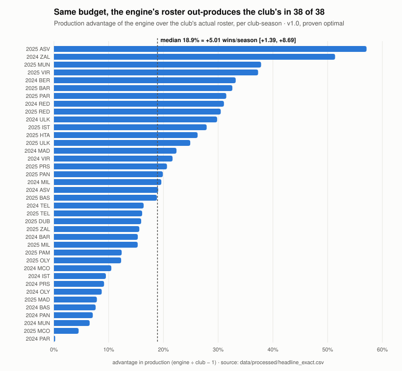

# EuroLeague Roster Optimization

A linear-programming engine that builds a EuroLeague roster under a fixed budget, backtested
against the rosters real clubs actually fielded.

**Status:** `v1.0` — model frozen. From here the engine takes bug fixes only.

---

## The claim

**On the same budget, the engine's roster would have won about 5 more games per season than
the club's actual roster.**

```
  +5.01 wins per season        95% CI  [+1.39, +8.69]
  adv_cap = 0.1892             median production advantage, 38 club-seasons
  38 of 38                     club-seasons where the engine's roster out-produces the club's
```

Measured on every EuroLeague club in two test seasons, 2024/25 and 2025/26 — 38
club-seasons. The engine is trained only on seasons before the one it is tested on.

> **Dashboard:** [dashboard-mu-eight-81.vercel.app](https://dashboard-mu-eight-81.vercel.app/)



*Generated by `src/readme_figure.py` from `headline_exact.csv`, the same file the headline comes from.*

---

## How it was measured

**The engine.** For each club-season, a mixed-integer program picks a roster from the whole
league's player pool and allocates its minutes, maximising predicted production under the
club's own budget. The budget is what the club's actual roster would cost under the same
price model, so both sides spend the same.

The program carries four kinds of constraint:

- **Budget.** Players are priced by a market cost model with club and season fixed effects
  (ADR 0001).
- **Roster and position floors.** 12–16 players, and each position within its observed
  share of minutes.
- **Ball identity.** The roster's minutes-weighted usage must equal 20%: five players on the
  court and one ball. This is an identity, not an estimate.
- **Shape of the rotation.** No roster may concentrate minutes more than the most
  concentrated real club did, for every top-k from 1 to 8 (ADR 0005). Without this the
  engine gave its top six players 192 minutes; the most concentrated of the 38 real
  club-seasons gave its top six 145.3.

**The comparison.** Both sides are scored on the production that actually happened
(`ppm_true`), and **neither side gets hindsight** (ADR 0006):

- the engine is credited for the minute plan it committed to, cut to the availability that
  actually materialised;
- the club is credited for the rotation it actually played.

Minutes planned for a player who turned out to be injured are not moved to his teammates.
They fall to replacement level, because that is the real cost of planning around an absent
player.

**Proof, not approximation.** The headline solves are run with a zero optimality gap and
proven optimal in 38 of 38. A 0.5% gap turned out to move a single club-season by up to
14 points (`headline_exact.py`).

**Wins.** Production is converted to wins by a within-season regression of club wins on club
production, with net budget as a control. The confidence interval bootstraps the slope and
the gap together.

### The number comes with its decomposition

Two earlier scoring conventions each carried a bias. Reporting `0.1892` without these three
lines would mislead. Each line changes **one thing** from the previous convention. They
interact, so they are not a sum:

```
  previous convention: both sides reallocated with hindsight     0.1414   4.26 wins

  change one thing:
    score the club on what it played (no flattering reallocation)  0.3232   +18.18 pp
    take the engine's hindsight away                               0.0423    -9.91 pp
    add the rotation-shape constraint                              0.1235    -1.79 pp

  all three together = v1.0                                      0.1892   5.01 wins
```

The old convention flattered the club more than it favoured the engine, so the earlier
headline was conservative. Most of the old advantage, as it was measured then, came from
the engine's hindsight, not from better player selection. Remove that hindsight from the
engine alone and the advantage falls to 0.0423. Both runs, and the rule declared before
them, are in ADR 0005 and ADR 0006.

---

## Four caveats

1. **Depth.** The engine carries 12 players; real clubs carry 15–20. The shape constraint
   spreads minutes across the same twelve, and does not buy more players. The cost of that
   thin roster is measured, not assumed: 14.2% of the engine's planned minutes went to
   players who turned out to be unavailable, and those minutes fell to replacement level.
   The engine wins anyway. Scoring depth as insurance (Monte Carlo over availability) is
   on the v2 list.
2. **Fatigue is not modelled.** A fatigue discount for minutes above 30 was designed and
   estimated, and rejected by a rule declared in advance (ADR 0004). Box scores cannot
   separate fatigue from a coach riding a hot hand. This does **not** show that fatigue is
   absent.
3. **Extrapolation.** The wins conversion was learned from score differences smaller than
   the ones the engine produces. The budget axis is in normalised units, and the dashboard
   greys out every budget outside the range real clubs actually spent (12.46–25.26). Nothing
   here is in euros: that mapping was tested and rejected, and all euro display removed.
4. **The shape caps matter.** The rotation-shape caps are the observed maxima (SLACK 1.00).
   Tightening them by 5% cuts the median advantage on the declared 12-club-season subsample
   from 13.9% to 9.8%; loosening them by 5% does not raise it (13.4%). All 24 solves proven
   optimal, 12/12 still positive at both settings. The rule declared in advance classes
   this as *sensitive*: it is reported here, and SLACK 1.00 stays the specification — the
   sensitivity is never used to choose it (`slack_sensitivity.py`).

**What this is not.** It is not a claim that the engine manages minutes better than
coaches. The hindsight convention that implied that was stopped (ADR 0005). It is not a
forecast for a season not yet played. And 38 of 38 is a reason to look harder before it
is a reason to be pleased. One candidate explanation, the pool restriction on the club
side, was checked and eliminated (`pool_restriction_check.py`).

---

## Alternative explanations tested

| Explanation | Test | Result |
|---|---|---|
| The constraints alone produce the gap | a random roster under the same constraints | worse than the club: −1.72 wins [−3.32, −0.35] |
| It is just money | club production → wins with net budget as a control, 38 club-seasons | 64% of the slope survives the control |
| Selection bias in the engine's picks | the predicted vs realised production of selected players | bias near zero; the loss to prediction error is reported separately as the winner's curse |

The first and third rows were measured under the pre-v1.0 scoring convention. Re-deriving
them under ADR 0006 is on the v2 list.

---

## Reproduce

The processed data is committed. From a clone:

```bash
pip install -r requirements.txt
python src/scoring.py                # shape caps -> data/processed/shape_caps.csv (seconds)
python src/shape_constraint_test.py  # 24 tests, must print 24/24 (~2 min)
python src/headline_exact.py         # 38 exact solves -> headline_exact.csv (~45 min)
python src/wins_conversion.py        # -> wins_conversion.csv; also reproduces the old 4.26 as a guard
python src/export_dashboard.py       # checks every frozen value -> dashboard_data.json
```

Every script prints its guards (✅/❌). A frozen value that fails to reproduce stops the
dashboard build.

Longer runs, not needed for the headline:

```bash
python src/shape_run.py              # the full ADR 0005/0006 grid, 152 solves (10–13 h)
python src/slack_sensitivity.py      # sensitivity of the headline to the shape caps
```

The no-shape solves in `shape_run.py` occasionally take hours. Which one is chance: CBC is
not deterministic in runtime. The headline path does not include them.

---

## Repository

```
src/
  scoring.py              the shape constraint and the scoring conventions (ADR 0005/0006)
  usage_constrained.py    the headline LP: budget, positions, ball identity, shape
  headline_exact.py       the v1.0 headline at gap = 0
  wins_conversion.py      production -> wins, with CI
  export_dashboard.py     frozen values, checked, -> dashboard_data.json
  shape_constraint_test.py
  cost_market.py          the market cost model (ADR 0001)
docs/
  adr/                    every design decision, with the rule declared before each run
  closing-plan.md         how the project closes, and the v2 list
CONTEXT.md                the vocabulary: terms used here mean one thing
METHODS.md / .pdf         every statistical tool used, in plain Hebrew
dashboard/                React/Vite front end
```

**How the project was run.** Before each run, predictions were locked from two sides, and a
decision rule was written down that said what each possible result would license. One
feature was rejected on evidence (ADR 0004). One scoring convention was stopped by the rule
it had been given in advance (ADR 0005). Misses are recorded next to hits.
