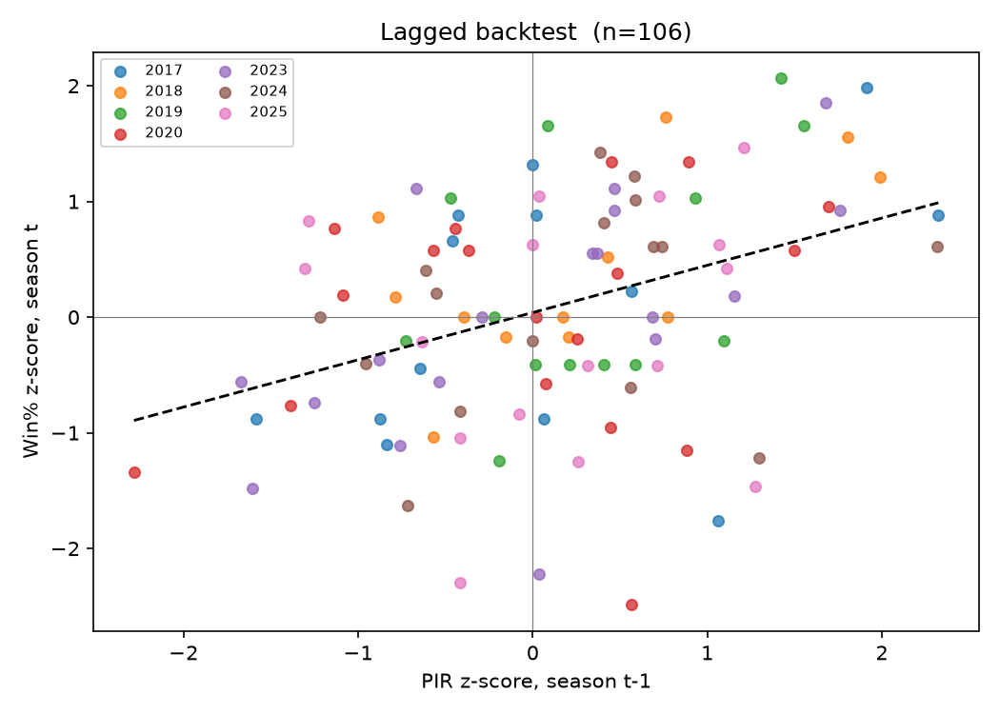

# EuroLeague Roster Optimization

Allocating a fixed budget across a EuroLeague roster under uncertainty, using
mathematical optimization on nine seasons of real player data.

**Status:** Week 1 complete — dataset built, validated, and the predictive
premise formally tested. Optimization model in progress.

---

## The question

Given a budget constraint and a pool of available players, which roster
maximizes expected team performance — and how stable is that selection when
player valuations are uncertain?

Before that question is worth asking, one thing has to be true: **aggregate
player value must actually predict winning.** If it doesn't, any optimization
built on top of it maximizes noise. Week 1 was spent testing exactly that.

---

## Result: the premise holds

Regression of a team's win percentage in season *t* on its minutes-weighted
PIR in season *t-1*, both standardized within season.

| Coverage filter | n | R² | Coefficient | 95% CI (clustered) | p |
|---|---|---|---|---|---|
| none | 108 | 0.170 | +0.443 | [+0.236, +0.649] | <0.0001 |
| ≥ 90% | 106 | 0.149 | +0.409 | [+0.204, +0.613] | 0.0001 |
| ≥ 95% | 93 | 0.141 | +0.424 | [+0.188, +0.661] | 0.0004 |

Standard errors are clustered by team: the same club appears in up to eight
rows, so its seasons are not independent observations. Clustering widened the
standard errors by 8–11%, which quantifies how optimistic naive OLS would have
been here.

The coefficient moves only between +0.41 and +0.44 across three different
exclusion thresholds, and no confidence interval approaches zero. **The
conclusion is not an artifact of where the filter was set.**



### The diagnostic contrast

The same regression run contemporaneously — season *t* PIR against season *t*
wins — yields R² = 0.517 (coefficient +0.765).

| Specification | R² |
|---|---|
| Contemporaneous (*t* → *t*) | 0.517 |
| Lagged (*t-1* → *t*) | 0.149 |

The contemporaneous fit is partly tautological and is not the headline. Its
purpose is diagnostic: it separates two failure modes. A weak lagged result
combined with a strong contemporaneous one means the metric works and the
*roster* is what fails to persist — roughly 71% of the within-season
relationship erodes across one offseason.

That erosion is the case for this project. If value persisted intact, roster
construction would be trivial: keep the same team. It doesn't, which is why
allocation is a real decision.

---

## Methodology

**PIR, not Net Rating.** Net Rating is close to a win by construction;
correlating it with wins is circular. PIR is a cumulative individual
contribution measure, not an outcome measure.

**Lagged, not contemporaneous.** PIR also correlates with winning within a
season — a team that won a game almost necessarily accumulated more PIR in it.
The fix is timing, not metric choice: season *t-1* PIR predicts season *t*
wins.

**Minutes-weighted.** PIR is minutes-dependent, so weighting by minutes
dissolves the arbitrary "8–9 rotation players or 12?" cutoff rather than
answering it.

**Normalized per game played.** Season length varies (30 rounds through
2018-19, 28 in the truncated 2019-20, 34 through 2024-25, 38 in 2025-26).
Games played is read per team from the official standings rather than inferred
league-wide, so a truncated or distorted schedule surfaces instead of hiding.

**Standardized within season.** Raw PIR per game is not comparable across
seasons: Baskonia in 2025-26 out-produced Olympiacos in 2016-17 (92.5 vs 83.7)
while winning half as often, because a 20-team league distributes production
differently than a 16-team one. Z-scoring within season neutralizes league
size, season length, and pace simultaneously.

**Regular season only.** The playoff field is unbalanced — eight teams, unequal
game counts — and inflates strong teams' PIR precisely because they won. That
is a back door to the same circularity.

---

## Data

Source: [`euroleague-api`](https://pypi.org/project/euroleague-api/), accumulated
player statistics and official standings.

**Scope rule: the round-robin era, 2016-17 onward.** Before 2016-17 the
competition used a group format in which teams faced different opponent sets,
making cross-team totals non-comparable. This is the same criterion that
excludes 2021-22 below, applied consistently rather than as a convenience.

Nine seasons, 2016-17 through 2025-26, less 2021-22. **158 team-seasons.**

### Validation

Before switching data sources, both were reconciled against each other:

| Metric | Game-level boxscore (328 requests) | Season endpoint (1 request) |
|---|---|---|
| Total minutes | 123,200.0 | 123,200.0 |
| Unique players | 295 | 295 |
| PIR — Olympiacos | 3,411 | 3,411 |
| PIR — Real Madrid | 3,388 | 3,388 |

Structural checks are made against numbers derivable from the rules of the
game, not against what looks plausible. Five players on court for 40 minutes
means 200 player-minutes per game; 34 rounds means 6,800 per team, with any
excess attributable to overtime and any shortfall indicating loss.

---

## Limitations

**No salary data.** Public EuroLeague salary figures do not exist as a
dataset — only journalistic estimates, net of tax, unnormalized, covering
mostly the top ten earners. Rather than pretending otherwise, the uncertainty
itself is modeled: a calibrated point estimate with a justified error width,
then Monte Carlo simulation to test whether the selection is stable across that
range.

**Mid-season transfers are dropped.** A player who changes clubs mid-season
receives a concatenated team code (`OLY;PAR`) and a single combined row; the
endpoint provides no basis for splitting his minutes between the two clubs. Any
attribution would invent a number. The affected share has grown from 0.2–0.8%
of league minutes through 2021-22 to 1.85% (2022-23), 2.50% (2023-24) and 2.27%
(2025-26) — a structural feature of the modern league, not an anomaly.

**The omission is not random with respect to the outcome.** Contenders buy at
the deadline and strugglers sell; both produce concatenated codes. Olympiacos —
the 2025-26 champion and regular-season top seed — landed at 91.7% minutes
coverage precisely because it bought two players mid-season, while Partizan at
79.5% had sold three. Any coverage threshold therefore filters on something
correlated with winning. This is why the backtest is reported across three
thresholds rather than one.

**2021-22 is excluded, for a technical reason rather than the obvious one.**
Russian clubs were expelled mid-season and the league recomputed its table as
though those fixtures had never occurred, at 28 games per club. The accumulated
player statistics were *not* recomputed and still reflect 30–32 games — and not
uniformly, since clubs had played different numbers of fixtures against the
expelled teams before the expulsion. Measured coverage ranges from 107.5% to
114.3%. Numerator and denominator describe different periods.

Recovery is possible by re-aggregating from game-level boxscores with the
expelled opponents filtered out (~330 API requests, for roughly 30 additional
pairs). Not done: the existing sample is sufficient for the gate decision.

**Confounding between metric validity and club persistence.** The lagged
regression measures two things at once: that PIR captures value, and that rich
clubs stay rich. Real Madrid occupies three of the five highest PIR z-scores in
the dataset. Separating the two would require conditioning on roster
continuity, which is out of scope here.

**23 clusters.** Clubs appearing in only one season drop out of the pairing, so
cluster-robust inference rests on a modest number of groups. The plain-to-
clustered standard error ratio of 1.08–1.11 suggests the panel dependence is
mild, which limits how much this matters.

**Sample skews recent.** Early transitions contribute 12–13 pairs each (a
16-team league with 3–4 clubs rotating annually), later ones 17–18.

**Additivity.** Summing individual PIR assumes roster value is additive and
ignores fit, role overlap, and lineup synergy.

---

## Repository

```
src/
  paths.py                  single source of truth for all filesystem paths
  fetch_all_accumulated.py  pulls one accumulated request per season
  build_team_season.py      aggregation, per-team normalization, z-scores
  backtest.py               lagged regression, clustered SEs, robustness runs
  audits/                   one-off verification scripts (schema, coverage)
data/
  raw/                      accumulated_rs_{season}.csv, gitignored
  processed/                team_season.csv, backtest_results.csv
figures/
  backtest_scatter.png
```

Raw data is gitignored; the processed dataset is committed so results are
inspectable without re-running the pull.

### Reproduce

```bash
pip install -r requirements.txt
python src/fetch_all_accumulated.py    # 9 requests, ~30s
python src/build_team_season.py        # -> data/processed/team_season.csv
python src/backtest.py                 # -> backtest_results.csv + figure
```

---

## What Week 1 actually surfaced

Three bugs in the pipeline produced clean-looking CSVs and threw no errors.
Each was caught by checking a number against an expectation derived beforehand,
not by the code failing:

- Filtering did-not-play on an undocumented `IsPlaying` flag returned exactly
  5.00 players per team per game — the starting lineup, not the roster. The
  measurement would have been of starters' value, answering a different
  question entirely. Fixed by filtering on `Minutes > 0`.
- A relative output path resolved against the working directory, silently
  writing to a second `data/` tree. Success messages now print the absolute
  path they wrote to, and a guard in `paths.py` raises on a stray directory.
- Team code `PAR` is Partizan Belgrade, not Paris (`PRS`). The intuitive
  expansion of a three-letter code is a guess, not an identifier; this one was
  caught only by checking player names against the codes.

### Validation

The core metric was checked against two independent sources before use.

PIR values returned by the API were recomputed by hand from the
box-score formula for five player-seasons; all five matched exactly.
Season-level aggregates were then cross-checked against game-level
boxscores for one season: 123,200 minutes and 295 players, with
identical PIR totals from both endpoints.

Neither check was expected to fail. Both were run because a metric
that is wrong in the same way everywhere produces a clean-looking
regression and no error.
